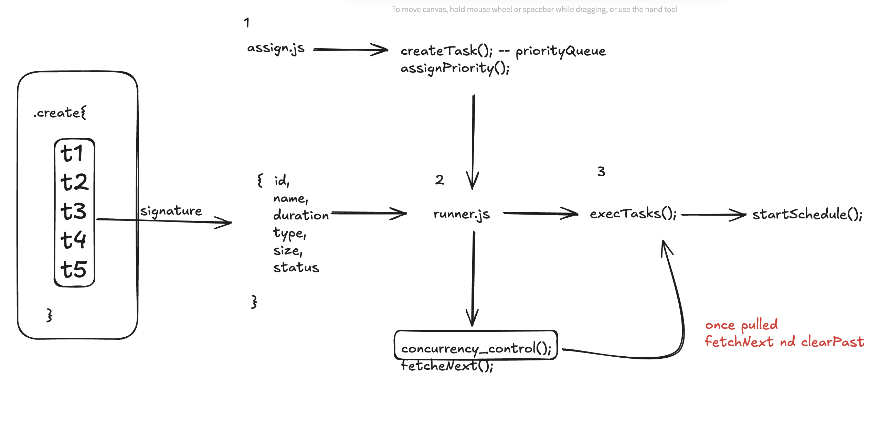

planOfAction
cd --> https://excalidraw.com/#json=NhY26783YTIWss6O_2elG,4YFSefY3xH6BaTtYj8DaDg

🔹 Example Workflow for Your Scheduler

Use Inquirer to let the user add jobs + set priority.

Display all jobs in a cli-table3 with colors from Chalk.

While jobs run, show spinners with Ora or a task list with Listr2.

If you want fancy, make a real-time dashboard with Blessed.